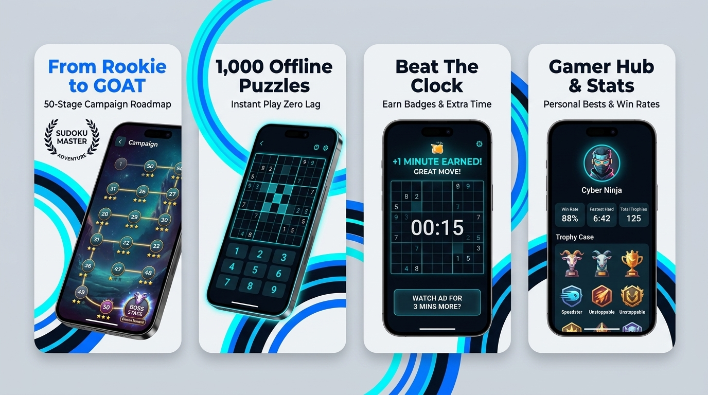
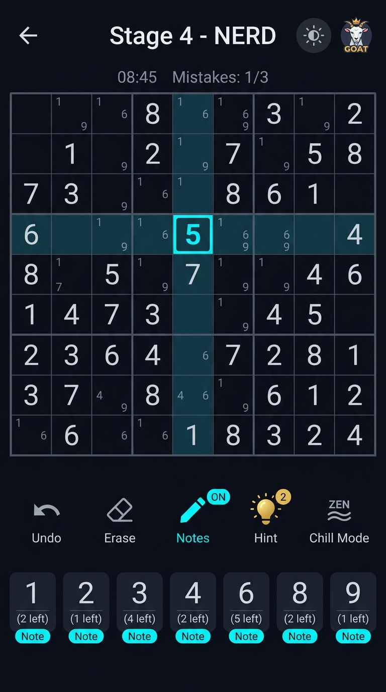
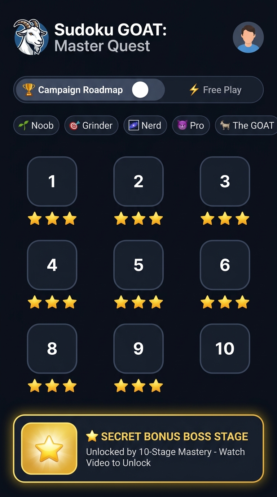
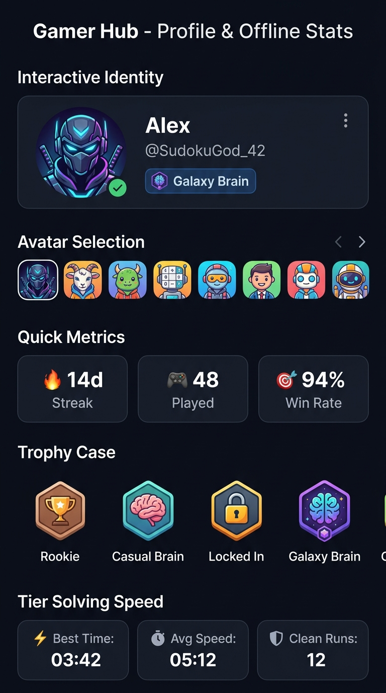

<div align="center">
  
  <h1>🐐 Sudoku GOAT: Master Quest</h1>
  <p><b>From Rookie to GOAT • 1,000 Verified Offline Puzzles • Modern Gamer Hub</b></p>
  <p>Package ID: <code>com.tecdroid.sudoku</code></p>
</div>

---

## 📸 App Showcase

<p align="center">
  
</p>

### 📱 In-Game Screens

<p align="center">
  
  &nbsp;
  
  &nbsp;
  
</p>

---

## 🌟 Key Features

* **Gamer Badge Progression (From Rookie to GOAT)**:
  * 🌱 **Level 0**: Rookie (Starting rank)
  * ✨ **Level 1**: Noob (Unlocks *"Casual Brain"* Badge)
  * 🎯 **Level 2**: Grinder (Unlocks *"Locked In"* Badge)
  * 🌌 **Level 3**: Nerd (Unlocks *"Galaxy Brain"* Badge)
  * 😈 **Level 4**: Pro (Unlocks *"Sudoku Demon"* Badge)
  * 🐐 **Level 5**: The GOAT (Unlocks *"The GOAT"* Legendary Badge)
* **1,000 Verified Offline Puzzles**:
  * 200 curated, uniquely solvable puzzles per tier stored in lightweight JSON (~270 KB).
  * 100% offline-first architecture with instant loading.
* **Dual Game Mode**:
  * 🏆 **Campaign Roadmap**: 50 stages with 1-3 star ratings and tier locks.
  * ⚡ **Free Play**: Unconstrained difficulty selection across all 5 tiers.
* **Secret Bonus Boss Stage**:
  * Beating Stage 10 in any tier unlocks an exclusive Bonus Boss Stage, accessible by watching a short rewarded video ad.
* **Smart Rewarded Ads**:
  * ⏰ **Overtime Extension**: Scaled extra time (+3 to +8 mins) on timeout via Rewarded Video.
  * 💡 **Smart Hint**: Voluntary Rewarded Video to reveal strategic placements.
  * 🛡️ **Offline Resilience**: Automatic "Emergency Free Pass" if offline or if no ad is filled.
* **Dual Theming**:
  * 🌙 **Obsidian Dark Mode** (Default high-contrast gamer vibe)
  * ☀️ **Pure Paper Light Mode** (Clean daytime reading)
  * One-tap instant theme toggle in the header.
* **Gamer Profile & Local Analytics Hub**:
  * Custom Display Name & Gamer Tag (`@handle`).
  * 8 selectable gamer avatars (*Cyber Ninja, Pixel Knight, Galaxy Brain, Chill Capybara, Neon Bot, Mystic Wizard, Speed Demon, The GOAT*).
  * Offline stats: Games played, Win rate %, Personal Best (PB) speed, Average solving time per tier, and Clean Runs.
* **Positive Reinforcement "Hype Engine"**:
  * Encouraging toasts (*"Cooking! 🔥"*, *"Big Brain! 🧠"*, *"Locked In! 🎯"*).
  * Empathetic cushion on timeouts (*"Almost had it! Grab extra time & seal the win"*).

---

## 🏗️ Architecture & Code Standards

* **State Management**: Zustand stores (`useGameStore`, `useCampaignStore`, `useProfileStore`, `useThemeStore`).
* **Zero UI Logic**: UI components (`SudokuGrid`, `SudokuCell`, `Numpad`, `ActionToolbar`) are purely declarative dumb views consuming actions and selectors.
* **Performance**: Memoized 81-cell grid (`SudokuCell` with custom `areEqual` comparison) ensuring 60/120 FPS on all Android devices.
* **Secrets Security**: All AdMob App and Unit IDs are stored in `.env` and typed via `@env` module.

---

## 🔑 Environment Variables & AdMob Setup

Create a `.env` file in the root directory (based on `.env.example`):

```bash
# AdMob Application and Ad Unit IDs
# Test IDs below can be used for safe development
ADMOB_ANDROID_APP_ID=ca-app-pub-3940256099942544~3347511713
ADMOB_BANNER_ID=ca-app-pub-3940256099942544/6300978111
ADMOB_REWARDED_TIMER_ID=ca-app-pub-3940256099942544/5224354917
ADMOB_REWARDED_BONUS_ID=ca-app-pub-3940256099942544/5224354917
ADMOB_INTERSTITIAL_ID=ca-app-pub-3940256099942544/1033173712
APP_ENV=production
```

When publishing to Google Play Store, replace these with your production Ad Unit IDs from [admob.google.com](https://admob.google.com).

---

## 🚀 Running the App

### 1. Install Dependencies
```bash
npm install
```

### 2. Start Metro Bundler
```bash
npm start
```

### 3. Run on Android Device / Emulator
```bash
npm run android
```

---

## 📦 Building for Google Play Store (Release AAB)

1. Generate your production upload keystore (or use Play App Signing).
2. Build the Android App Bundle (`.aab`):
```bash
cd android
./gradlew bundleRelease
```
The optimized bundle will be generated at:
`android/app/build/outputs/bundle/release/app-release.aab`

---

## 📄 License
Private & Proprietary - TecDroid. All rights reserved.
